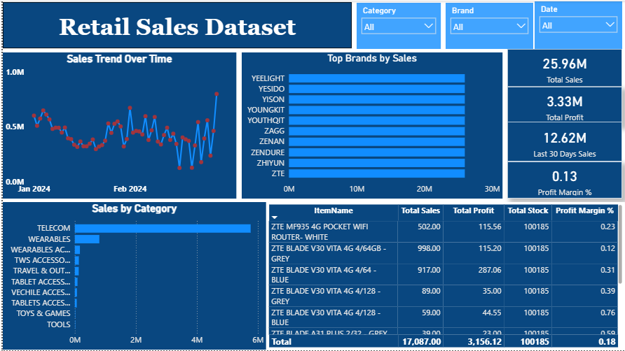

# 📊 Retail Sales Analytics Dashboard | Power BI


An end-to-end interactive Power BI dashboard for retail sales performance monitoring, brand analysis, and profit trend visualization.

---

## 📸 Dashboard Preview



---

## 📌 Key Metrics

| Metric | Value |
|---|---|
| 💰 Total Sales | 25.96M |
| 📈 Total Profit | 3.33M |
| 🗓️ Last 30 Days Sales | 12.62M |
| 📊 Profit Margin % | 0.13% |

---

## ✨ Key Features

- **Sales Trend Over Time** — Line chart tracking monthly sales with peak detection markers
- **Top Brands by Sales** — Horizontal bar chart ranking brands (YEELIGHT, ZTE, ZAGG, etc.)
- **Sales by Category** — Breakdown across Telecom, Wearables, Tablets, Travel & Outdoor, and more
- **Product-Level Table** — Item-wise Total Sales, Profit, Stock, and Profit Margin %
- **Dynamic Slicers** — Filter by Category, Brand, and Date
- **KPI Cards** — At-a-glance tiles for all key metrics

---

## 🛠️ Tech Stack

- **Power BI Desktop** — Report creation & visualization
- **DAX** — Custom measures and KPI calculations
- **Power Query (M)** — Data transformation and cleaning
- **Excel / CSV** — Source data format

---

## 📁 Project Structure

```
Retail-Sales-Dashboard/
├── Data/
│   └── retail_sales_dataset.xlsx
├── Report/
│   └── RetailSalesDashboard.pbix
├── Screenshots/
│   └── dashboard_overview.png
└── README.md
```

---

## 🚀 Getting Started

1. **Clone this repository**
2. **Open Power BI Desktop** (free from [Microsoft](https://powerbi.microsoft.com/desktop/))
3. **Load** `Report/RetailSalesDashboard.pbix`
4. **Update data source** to point to `Data/retail_sales_dataset.xlsx` and click Refresh
5. **Explore** using the Category, Brand, and Date slicers

---

## ⚙️ Sample DAX Measures

```dax
Total Sales = SUM(Sales[SaleAmount])

Total Profit = SUM(Sales[Profit])

Profit Margin % = DIVIDE([Total Profit], [Total Sales], 0)

Last 30 Days Sales =
  CALCULATE(
    [Total Sales],
    DATESINPERIOD('Date'[Date], LASTDATE('Date'[Date]), -30, DAY)
  )
``

⭐ *Star this repo if you found it helpful!*
